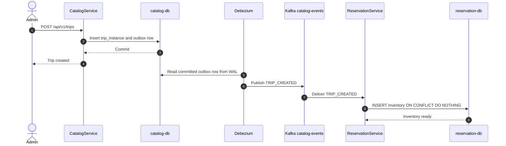
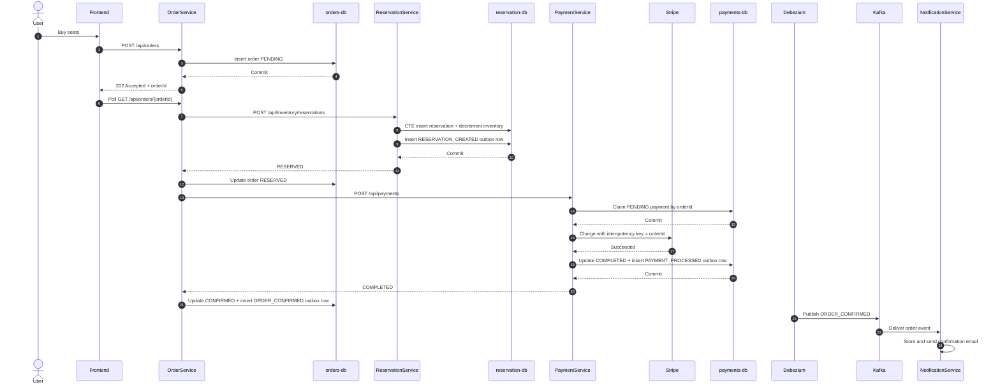
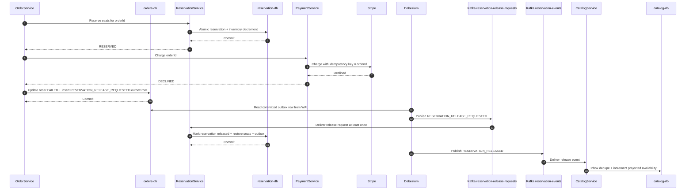
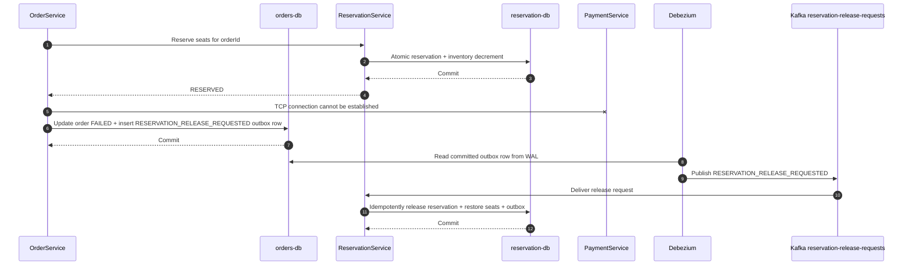
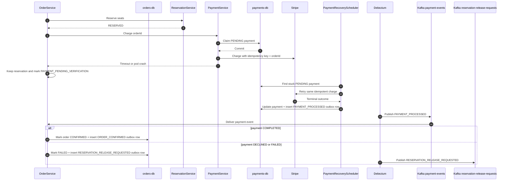
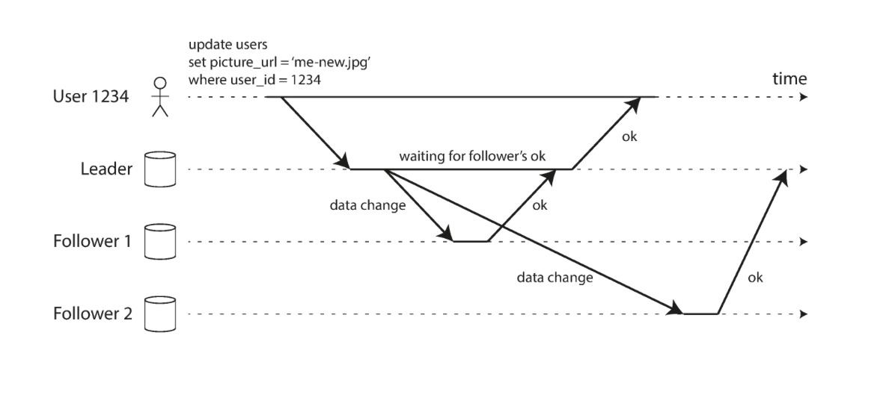

# EuroTransit - A Discussion on Consistency Models

## Pillar B: Consistency under contention (Inventory problem)

**Project Requirements:**

- Choose and justify a consistency model for inventory reservation using CAP / PACELC terms. State explicitly what you sacrifice in a partition and what latency consistency trade-off you accept when there is no partition.
- Implement it (e.g., conditional/atomic reservation in PostgreSQL, a reservation state machine, or a documented reconciliation strategy with compensating actions).
- Idempotency is mandatory across the money path: a duplicated order-placed event or a retried payment authorization must not double-reserve or double-charge.
- Use idempotency keys / deduplication and document the scheme.
- Demonstrate, under a chaos experiment, that the invariant ("never oversell") holds even when messages are duplicated or a Pod dies mid-reservation.

---

### The CAP and PACELC Theorems

The CAP theorem states that when our system is faced with a network partition—that is, one or more nodes of our distributed system form a partition where they are not able to be contacted by the rest of our well-functioning system—then our system overall must decide between being available or being consistent.

The CAP theorem, however, only describes how our system should behave under the conditions of a network partition, but most of the time our system is not actually under a network partition. Most of the time, the network between our nodes behaves correctly with reasonable RTT between the various nodes.

This is why another theorem called the PACELC theorem was introduced, which describes how our system should behave when there is no network partition. Should we prioritize Latency or Consistency (PAC ELC -> “Else Latency or Consistency”)?

Considering our domain of a Train Ticket Reservation application, which is a money-sensitive application that processes real money, we decided to prioritize Consistency over Availability or Latency. Concretely, what this means is that we are making the trade-off of making our final users wait more for the whole checking out process rather than risking finishing in an inconsistent state (such as tickets oversold, or payment events getting lost due to database nodes being shut down).

Note that in microservice applications, inconsistencies refer not only to inconsistencies within one logical database that might be distributed across multiple physical database nodes (which is the actual case for all of our logical databases in our application like `catalog-db`, `orders-db`, `reservation-db`), but also inconsistencies among different databases because this application heavily makes use of distributed transactions.

We are going to analyze in which cases this is most likely to happen and how we have protected against them.

---

### Replication and Consistency

Replication means keeping a copy of the same data on multiple machines that are connected via a network:

- To keep data geographically close to your users (and thus reduce access latency)
- To allow the system to continue working even if some of its parts have failed (and thus increase availability)
- To scale out the number of machines that can serve read queries (and thus increase read throughput)

In our case, we mainly applied Replication to obtain a fault-tolerant system even if 1 or more nodes of our database fail, since that was the main requirement for this project. For this reason, using the CNPG Kubernetes operator, we provision multiple databases for each of our microservice applications, and each is currently replicated over 3 nodes: 1 primary node which all write requests go to, whereas read requests can go to any of the nodes.

However, every time we replicate our database over multiple nodes we inevitably introduce the risk of inconsistencies, and we’re going to go over in detail about which consistency models we decided to apply for each microservice.

---

### The Checkout Architecture (Asynchronous Execution)

Let’s consider the main API that our application exposes: the Checkout API.

1. It starts by creating a new order with a Twitter Snowflake ID and with status = `PENDING`.
2. Save the order to the orders database.
3. We launch the asynchronous pipeline for processing the order.
4. Return a quick result to the user to tell them that their order is being processed.

The reason why we return a quick `202 Accepted` response to the user associated with a UUID for fetching later the status of the order is because we don’t want to exhaust our Tomcat server by keeping multiple connections opened. If the response was synchronous, each connection would have to be kept open until the whole checkout process finishes.

The asynchronous pipeline consists of:

1. Reserving a seat for the customer.
2. If reservation was successful, then contact payment.
3. If payment reaches a terminal failure, or if OrderService knows PaymentService was never reached at all, then fail the order and write a `RESERVATION_RELEASE_REQUESTED` event to the Orders outbox in the same transaction.
4. Debezium publishes that committed outbox row to Kafka, and ReservationService performs the compensating seat release idempotently.

---

### Sequence Diagrams

These diagrams connect the consistency discussion to the concrete services in the project.

#### Catalog to Inventory Bootstrap

When an operator creates a new trip, CatalogService remains the owner of the public catalog, while ReservationService builds its own inventory row from the `TRIP_CREATED` event.

#### Successful Checkout

The client receives a fast `202 Accepted`, then the OrderService background pipeline performs the consistency-critical work: atomic reservation first, payment second, order confirmation last.

#### Payment Failure and Seat Release

The system reserves before charging. If payment has a known terminal failure, for example a card decline, OrderService does not leave the seat locked. It marks the order as `FAILED` and writes a `RESERVATION_RELEASE_REQUESTED` event to the Orders outbox in the same local database transaction.

This is the important fix compared with the earlier design: the order failure and the release request are no longer two independent writes. OrderService still does not run a distributed transaction with ReservationService, but its own state transition and its outgoing release request are now atomic. Debezium then publishes the release request after commit, and ReservationService performs the actual release in its own transaction.

#### PaymentService Definitely Not Reached

Seat release is also safe when OrderService knows the payment request never reached PaymentService, for example because it could not even establish a TCP connection to PaymentService. In that case there is no `PENDING` payment row, no Stripe call to recover, and no future `PAYMENT_PROCESSED` event to wait for. Holding the reservation would leak seats forever, so OrderService fails the order and emits the release request through the same outbox path.

#### Uncertain Payment Outcome Recovery

If PaymentService becomes unreachable after it may have received the request, the outcome is unknown: PaymentService may already have created a `PENDING` payment row, may have called Stripe, or may crash before returning to OrderService. In this case OrderService must not release the seat immediately. It moves the order into `PAYMENT_PENDING_VERIFICATION`, keeps the reservation held, and waits for the durable payment event or recovery scheduler.

---

### Idempotency, Inbox, and Outbox Patterns

Networks by default are unreliable. A message might be duplicated and received by the server multiple times. At the same time, under the asynchronous network model, message brokers usually always implement the At-Least-Once semantic, which means that a Kafka message that we publish only once might actually be sent two times.

Imagine if a message for booking a seat is processed by the Reservation service twice, or even worse, a message for charging the user is applied two times. We are charging the user twice and thus destroying our reputation.

Thus, we must talk about Idempotency: the result of performing an action multiple times is the same as having performed it just once, and it’s exactly what we implemented in our project.

We handle deduplication of messages using client-side generated keys combined with a pattern called the Inbox Pattern on the server side.

This pattern has been further combined with its sibling pattern, the Outbox Pattern, for achieving eventual consistency between various microservices without relying on the heavy 2PC protocol for distributed transactions with eventual compensation actions in case of partial failures.

#### Why We Use Snowflake IDs Instead of DB Auto-Increments

One thing we learned during this project was adopting decentralized IDs (Snowflake IDs) and managing the IDs of our database entities ourselves rather than relying on the database ID generation upon entity persistence.

- **Asynchronous API Responses:** To give the frontend an ID so it can poll for status updates, if we used DB-generated IDs, our application thread would have to open a synchronous JDBC connection, lock the database, perform an `INSERT`, wait for the disk to assign the ID, and return it. Under heavy load, this exhausts connection pools.
- **The Transactional Outbox:** When the OrderService publishes an `ORDER_CONFIRMED` event, that event must carry the Order ID so downstream consumers know what they are dealing with. Client-generated IDs allow you to construct the entity and the Outbox event in memory, and persist them both in a single, atomic database transaction.
- **Database Index Performance:** Because a UUIDv4 is completely random, every `INSERT` forces PostgreSQL to write to a random location in its B-Tree index, causing massive page fragmentation and disk thrashing. Because Snowflake IDs are sequential, PostgreSQL appends them neatly to the right side of the B-Tree index, maintaining blazing-fast write performance.

---

### Read-Your-Writes, Quorum Commits, and Avoiding Catastrophe

Keeping information consistent across different microservices is extremely important. Just as important is keeping information consistent from the point of view of the clients.

We separate two concerns that are often confused:

- **Read-Your-Writes:** after a user creates an order, status polling is routed to the primary database endpoint for the owning service. The user does not read from a lagging replica for their own recent write.
- **Quorum commit:** database writes wait until the primary and at least one synchronous follower have durably accepted the WAL record. This is a durability and failover guarantee: if the primary dies after acknowledging a write, a promoted follower still has the committed payment, reservation, order, or outbox row.

The screenshot below shows the idea behind synchronous replication: the leader waits for a follower acknowledgment before confirming the write to the client.

Let’s analyze exactly how setting up at least 1 synchronous follower helps avoid catastrophic scenarios:

#### Catastrophe 1: The Phantom Charge (The Orphaned Money)

The PaymentService successfully charges the user's credit card via Stripe. The PaymentService writes the Payment record and the `PAYMENT_PROCESSED` Outbox event to the Primary database.

- **The Disaster (Without Quorum):** The Primary database returns a success signal to the application and instantly explodes before it can stream its Write-Ahead Log (WAL) to the asynchronous replica. The CloudNativePG operator promotes the replica.
- **The Result:** Stripe has captured €45. The promoted replica has absolutely zero record of the payment or the Outbox event. Debezium never sees the event. The Kafka consumer never triggers. The system has stolen the user's money and permanently forgotten they exist.
- **The Solution:** By setting the number of synchronous follower replicas to 1, we guarantee that at least one replica is aware of the payment processed records that have been inserted in the database, and it can safely become the new leader without dropping the Outbox event.

#### Catastrophe 2: The Quantum Train Seat (The Physical Double-Book)

Two users, Alice and Bob, are trying to book the very last seat on Train T123.

- **The Disaster (Without Quorum):** Alice's request hits the ReservationService first. The Primary database executes the atomic lock (`available_seats - 1`) and commits the transaction. Alice proceeds to the Stripe payment screen. One millisecond later, the Primary database crashes before the asynchronous replica receives the WAL update. The operator promotes the replica. Because the replica never received the update, it thinks the seat is still available. Bob's request arrives. The new Primary allows Bob to lock the exact same seat.
- **The Result:** Alice pays. Bob pays. You have sold one physical train seat to two different human beings. This is the hardest problem in distributed systems: reconciling split digital state with immutable physical reality.
- **How `minSyncReplicas: 1` saves you:** Alice's reservation commit is forced to wait for the synchronous follower. If the Primary crashes before the follower acknowledges the write, the ReservationService throws an exception, and Alice's checkout fails safely before she is charged. If the follower does acknowledge it, the seat lock survives the failover. When Bob's request hits the newly promoted Primary, it correctly sees `available_seats = 0` and rejects him.
